# CPRD depression cohort
WORK IN PROGRESS

To add: 
  - Depression and biomarker code lists
  - Further QC steps to flow chart
  - Upload latest scripts
  

## Cohort definition
The cohort is defined using the following criteria:

**Inclusion:**
  - A Quality Outcome Framework code for depression
  - If the Quality Outcome Framework code is not diagnostic, another diagnostic "broad" depression code

**Exclusion:**
  - Patient is from one of the 44 practices that may have merged (unreliable patient data tracking)
  - Undetermined Gender
  - Non-diagnostic depression codes present at first evidence of depression (see broad_depression code list).
  - Diagnosed with a severe mental illness (excluding depression with psychosis) prior to depression.
  - Diagnosed with depression after introduction depression into the Quality and Outcomes Framework (01/04/2025)

```mermaid
graph TD;
    A["<b>CPRD Aurum December 2023 release</b><br>with linked November 2023 HES APC, and patient IMD"] -->|Unique patients with a depression-related medcode between 1988–30/12/2023| B["<b>Our extract</b>: n = 3,984,014"] --> C["<b>With a valid 'broad depression' code</b>: n = 3,581,691"]

```

